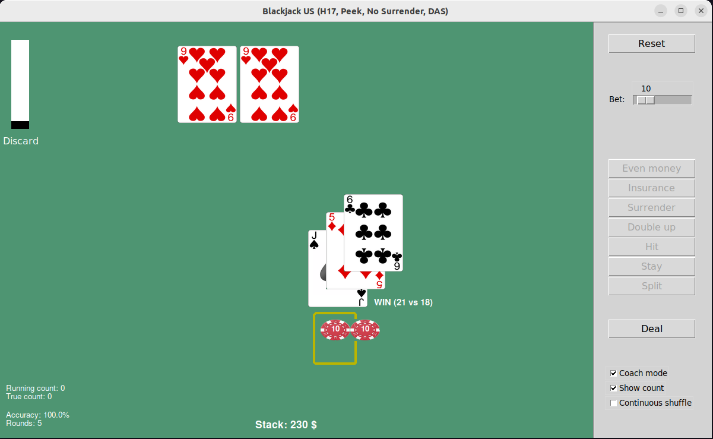

# blackjack-gui
Single-player Blackjack with GUI and possibility to simulate games.

## Installation
``` 
$ python3 -m venv venv
$ source venv/bin/activate
$ pip3 install blackjack-gui
```


## Usage

```
blackjack [OPTION...]
```

Options:

| Name         | Default | Description                                             | 
|:-------------|:--------|:--------------------------------------------------------|
| `--help`     |         | Show help and exit.                                     |
| `--n_games`  | 10      | Number of rounds to be played.                          |
| `--bet`      | 1       | Bet size.                                               |
| `--stack`    | 1000    | Initial stack.                                          |
| `--ai`       | False   | If True, computer plays instead of you.                 |
| `--count`    | False   | If True, computer player uses card counting.            |
| `--loglevel` | DEBUG   | Adjust amount of logging: DEBUG or INFO.                |
| `--cards`    |         | Simulate certain starting hand only. E.g. `--cards=A,8` |
| `--gui`      | True    | Play with GUI.                                          |


## Examples
Open GUI version:
```
$ blackjack
```

With the default settings, play 10 rounds of Blackjack without GUI:
```
$ blackjack --gui=False
```

Let the computer play perfect basic game and use card counting technique to bring down the house:
```
$ blackjack --n_games=100000 --ai=True --count=True --loglevel=INFO --gui=False
```

Simulate soft 19 starting hand only:
```
$ blackjack --n_games=10000 --ai=True --loglevel=INFO --gui=False --cards=A,8
```

## Notes
* Insurance and even money not implemented
* Otherwise, rules follow: https://casinohelsinki.fi/en/games/blackjack-eng/
* Card images taken from [here](https://code.google.com/archive/p/vector-playing-cards/).

## Licence
MIT
